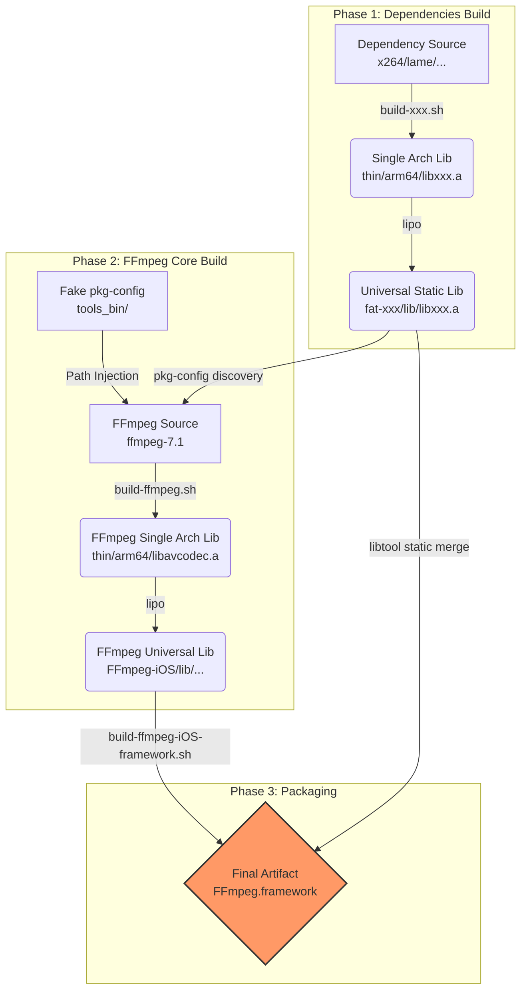

# FFmpeg Cross-Platform Build System (iOS, macOS, tvOS, Android) - FFmpeg 7.1 Technical Manual

[中文版 (Chinese Version)](README_CN.md)

> **Acknowledgement**: This project is based on and improved from [kewlbear/FFmpeg-iOS-build-script](https://github.com/kewlbear/FFmpeg-iOS-build-script), deeply adapted and refactored for modern Xcode, Apple Silicon, and FFmpeg 7.0+.

This is an enterprise-level collection of Shell scripts designed to solve the complexity of cross-compiling FFmpeg for iOS, tvOS, macOS, and Android on macOS. It is not just a compilation script, but a complete solution for **dependency management** and **artifact packaging**.

Based on the **FFmpeg 7.1** core, this project integrates mainstream codec libraries such as x264, x265, fdk-aac, dav1d, lame, opus, vpx, vorbis, and theora, and provides the ability to generate a `Framework` with one click, perfectly supporting Swift and Objective-C projects.

---

## 📚 Table of Contents

1.  [System Architecture & Workflow](#-system-architecture--workflow)
2.  [Prerequisites & Dependencies](#-prerequisites--dependencies)
3.  [Build Guide](#-build-guide)
    *   [iOS (iPhone/iPad)](#ios-iphoneipad)
    *   [macOS (Apple Silicon/Intel)](#macos-apple-siliconintel)
    *   [tvOS (Apple TV)](#tvos-apple-tv)
    *   [Android](#android)
4.  [Integration Guide](#-integration-guide)
    *   [Xcode Integration](#xcode-integration)
    *   [Fixing Linker Errors](#fixing-linker-errors)
5.  [Technical Deep Dive](#-technical-deep-dive)
    *   [1. Intelligent Dependency Injection (pkg-config Hijacking)](#1-intelligent-dependency-injection-pkg-config-hijacking)
    *   [2. Assembly Code Compatibility (Assembly & Bitcode)](#2-assembly-code-compatibility-assembly--bitcode)
    *   [3. Modern Framework Encapsulation](#3-modern-framework-encapsulation)
    *   [4. Special Handling for tvOS](#4-special-handling-for-tvos)
    *   [5. Modernizing Legacy Libraries (Theora/Vorbis/LAME)](#5-modernizing-legacy-libraries-theoravorbislame)
    *   [6. Special Target Mapping for libvpx](#6-special-target-mapping-for-libvpx)
6.  [Configuration & Customization](#-configuration--customization)
    *   [FFmpeg Version & Architectures](#ffmpeg-version--architectures)
    *   [Reducing Binary Size (Slimming Guide)](#reducing-binary-size-slimming-guide)
        *   [1. Basic Slimming (Safe)](#1-basic-slimming-safe)
        *   [2. Advanced Slimming (Recommended)](#2-advanced-slimming-recommended)
        *   [3. Extreme Slimming (Expert - Whitelist Mode)](#3-extreme-slimming-expert---whitelist-mode)
        *   [4. Other Optimization Tips](#4-other-optimization-tips)
    *   [Key Configure Parameters](#key-configure-parameters)
    *   [Size Reference Table (arm64)](#-size-reference-table-arm64)
7.  [Dependency Management & Build Internals](#-dependency-management--build-internals)
    *   [1. Automatic Dependency Detection](#1-automatic-dependency-detection-build-ffmpegsh)
    *   [2. Special Build Handling for Modules](#2-special-build-handling-for-modules)
8.  [Directory Structure](#-directory-structure)
9.  [Script Reference](#-script-reference)
    *   [Core Build Scripts](#core-build-scripts)
    *   [Dependency Build Scripts (Recommended Order)](#dependency-build-scripts-recommended-order)
10. [Licensing & Compliance](#-licensing--compliance)

---

## 🏗 System Architecture & Workflow

This build system adopts a **modular design**, following the workflow of "Compile dependencies first, then compile the core, and finally package".



---

## 🛠 Prerequisites & Dependencies

Ensure your macOS development environment is complete before starting.

### 1. Xcode & Command Line Tools
Ensure the latest version of Xcode is installed and run the following command to install command line tools:
```bash
xcode-select --install
```

### 2. Build Tools (Homebrew)
FFmpeg and its dependencies require a set of build tools. Install them using Homebrew:

```bash
# Basic compilation tools
brew install yasm nasm cmake pkg-config

# Build systems for specific 3rd-party libs
brew install meson ninja      # for dav1d
brew install autoconf automake libtool # for fdk-aac, lame, etc.
```

*   **yasm/nasm**: Assemblers, crucial for x264/x265 performance.
*   **cmake/meson**: Build systems for modern C++ projects.
*   **pkg-config**: Dependency management tool, core to this script for discovering compiled libraries.
*   **gas-preprocessor.pl**: (Automatically downloaded) Converts GNU assembly syntax to Apple Clang compatible syntax.

---

## 🚀 Build Guide

### iOS (iPhone/iPad)

iOS builds are the most complex as they usually involve the most 3rd-party libraries.

#### Step 1: Compile Dependency Libraries (Optional)
The scripts are designed to be **loosely coupled**. If you don't need a library (e.g., x265), simply skip the corresponding script. `build-ffmpeg.sh` automatically detects which libraries have been compiled.

Recommended build order:
```bash
# 1. Basic Codecs
./build-x264.sh        # H.264 (GPL)
./build-fdk-aac.sh     # AAC (Non-Free)
./build-lame.sh        # MP3

# 2. Advanced Codecs (On Demand)
./build-x265.sh        # H.265 (GPL, takes longer to compile)
./build-dav1d.sh       # AV1 Decoding
./build-opus.sh        # Opus Audio
./build-vpx.sh         # VP8/VP9

# 3. Ogg Ecosystem (Must follow order)
./build-ogg.sh         # Base layer
./build-vorbis.sh      # Depends on Ogg
./build-theora.sh      # Depends on Ogg
```

#### Step 2: Compile FFmpeg Core
```bash
./build-ffmpeg.sh
```
This step performs the following:
1.  Downloads FFmpeg 7.1 source code.
2.  Scans for `fat-*` folders in the current directory.
3.  Configures `pkg-config` paths to inject 3rd-party libraries into the FFmpeg build configuration.
4.  Compiles for `arm64` (Device) and `x86_64` (Simulator) separately.
5.  Uses `lipo` to merge and generate the `FFmpeg-iOS` directory.

#### Step 3: Package Framework
```bash
./build-ffmpeg-iOS-framework.sh
```
This script is extremely important. It merges **all** compiled static libraries (including libx264.a, libmp3lame.a, etc.) into a single binary within `FFmpeg.framework`. This means you **do not** need to manually add dozens of `.a` files in Xcode.

### macOS (Apple Silicon/Intel)
```bash
./build-ffmpeg-macos.sh
```
*   **Features**: Enables `VideoToolbox` (Hardware Acceleration) and `AudioToolbox`.
*   **Archs**: Includes `arm64` and `x86_64`, the generated Framework is ready for macOS App development.

### tvOS (Apple TV)
```bash
./build-ffmpeg-tvos.sh
```
*   **Strategy**: tvOS App Store reviews are strict, and device performance is uniform. The script defaults to **not integrating** 3rd-party libraries to ensure maximum stability and pass review. Relies solely on FFmpeg internal software decoding and VideoToolbox hardware decoding.

### Android
```bash
# Set NDK path first
export ANDROID_NDK_HOME=/path/to/ndk
./build-ffmpeg-android.sh
```
*   **Artifacts**: `.so` dynamic libraries in `FFmpeg-Android/jniLibs/`.
*   **Archs**: `arm64-v8a`, `armeabi-v7a`, `x86`, `x86_64`.

---

## 🔌 Integration Guide

### Xcode Integration

1.  **Import Framework**: Drag `FFmpeg.framework` into your project.
2.  **Set Embed**: In **General** -> **Frameworks, Libraries, and Embedded Content**, set it to **Do Not Embed** (since it's a statically linked framework).
3.  **Add System Libraries**: In **Build Phases** -> **Link Binary With Libraries**, add the following system libraries to avoid `Undefined symbol` errors:
    *   `libz.tbd` (Compression)
    *   `libbz2.tbd` (Compression)
    *   `libiconv.tbd` (Character Encoding)
    *   `AudioToolbox.framework` (Audio Processing)
    *   `VideoToolbox.framework` (Hardware Decoding)
    *   `CoreMedia.framework`
    *   `AVFoundation.framework`
    *   `libc++.tbd` (If C++ libraries like x265/dav1d are integrated)

4.  **Header Search Paths**:
    In **Build Settings**, find **Header Search Paths** and add:
    ```text
    $(PROJECT_DIR)/FFmpeg.framework/Headers
    ```
    This allows you to use `#include "libavcodec/avcodec.h"`.

### Fixing Linker Errors

*   **Error**: `Undefined symbol: _VTDecompressionSessionCreate`
    *   **Fix**: Missing `VideoToolbox.framework`.
*   **Error**: `Undefined symbol: _inflate`
    *   **Fix**: Missing `libz.tbd`.
*   **Error**: `Undefined symbol: operator new(unsigned long)`
    *   **Fix**: Missing `libc++.tbd` (Usually because x265 or dav1d are written in C++).

---

## 🔬 Technical Deep Dive

This set of scripts is more than just simple `configure` and `make` calls; it includes a series of "black magic" fixes and optimizations for the iOS/tvOS compilation environment.

### 1. Intelligent Dependency Injection (pkg-config Hijacking)

FFmpeg's build system relies heavily on `pkg-config` to find 3rd-party libraries (like x264, x265). In a cross-compilation environment, making FFmpeg correctly find our locally compiled iOS static libraries (instead of the system-installed macOS libraries) is a major pain point.

**Script Solution (`build-ffmpeg.sh`):**

*   **Virtual Environment**: The script dynamically creates a fake `pkg-config` script in the `tools_bin/` directory.
*   **Path Redirection**: When FFmpeg requests the path for `x264`, this fake script intercepts the request and forcibly returns the header and library paths from our local `fat-x264/` directory.
*   **Advantage**: Completely solves "Package xxxxx was not found" issues without polluting system environment variables.

### 2. Assembly Code Compatibility (Assembly & Bitcode)

FFmpeg contains a large amount of assembly code optimized for specific CPUs, but this often causes errors with the iOS Clang compiler.

*   **Gas-Preprocessor**: The script automatically detects and downloads `gas-preprocessor.pl`, a Perl script that converts GNU Assembler (GAS) syntax into Apple Clang compatible syntax.
*   **VVC Module Masking**: The VVC (H.266) decoder introduced in FFmpeg 7.1 contains a large amount of new AArch64 assembly that currently has compatibility issues with the iOS cross-compilation toolchain. The script automatically avoids this compilation error via `--disable-vvc` to ensure overall build success.
*   **Bitcode Support**: Enabled by default with `-fembed-bitcode` flag, ensuring compiled static libraries contain Bitcode segments (although deprecated in Xcode 14, retained for compatibility with older projects).

### 3. Modern Framework Encapsulation

Traditional scripts usually only generate `.a` files. This project's `build-ffmpeg-iOS-framework.sh` script does more:

*   **All-in-One Binary**: Uses `libtool -static` to merge **all** compiled static libraries (including FFmpeg core and enabled 3rd-party libraries like x264, LAME, etc.) into a single executable file within the Framework. This means you don't need to link multiple `.a` files in your project.
*   **Module Map**: Automatically generates `module.modulemap` file, allowing direct use of `import FFmpeg` in Swift projects.
*   **Umbrella Header**: Automatically generates `FFmpeg.h` umbrella header.

### 4. Special Handling for tvOS

The tvOS version aims for maximum stability and follows a **minimalist principle**:

*   **No 3rd-party Libraries**: To avoid complex linker errors and potential App Store rejections due to restricted APIs, `build-ffmpeg-tvos.sh` does not integrate any 3rd-party codecs (like x264/x265). It relies entirely on FFmpeg's internal decoders and system-level hardware acceleration.
*   **Targeted Pruning**: Explicitly disables `--disable-swscale-alpha` and other modules to ensure best performance on Apple TV platforms.

### 5. Modernizing Legacy Libraries (Theora/Vorbis/LAME)

Many classic open-source libraries (like libtheora, libvorbis) have outdated build systems that cannot directly recognize the `arm64-apple-ios` architecture.

*   **Automatic Patching**: `build-theora.sh` and `build-vorbis.sh` automatically detect and download the latest `config.guess` and `config.sub` from GNU official sources, and use `sed` to remove the obsolete `-force_cpusubtype_ALL` linker flag, solving modern Xcode linker errors.
*   **Dependency Chain Management**: For the Ogg family, scripts strictly follow the order of `libogg -> libvorbis/libtheora` and automatically inject the correct header search paths during the `configure` phase.

### 6. Special Target Mapping for libvpx

libvpx (VP8/VP9) has its own independent configuration system.

*   **Target Conversion**: The script automatically maps iOS `arm64` and `x86_64` architectures to libvpx-specific `arm64-darwin20-gcc` and `x86_64-darwin20-gcc` targets.
*   **High Bit Depth Support**: Defaults to `--enable-vp9-highbitdepth` to support more professional video playback needs.

---

## ⚙️ Configuration & Customization

All customizations are implemented by modifying variables at the top of the scripts.

### FFmpeg Version & Architectures
In `build-ffmpeg.sh`:
```bash
FF_VERSION="7.1"       # Change version
ARCHS="arm64 x86_64"   # Change architectures (e.g., remove x86_64 if only needing device)
```

### Reducing Binary Size (Slimming Guide)

FFmpeg enables a large number of rare codecs and protocols by default, which causes the generated Framework to be very large (usually between 50MB-100MB). For mobile apps, size control is crucial.

By modifying the `CONFIGURE_FLAGS` variable in `build-ffmpeg.sh`, you can achieve different levels of slimming.

#### 1. Basic Slimming (Safe)
These options have very low risk and do not affect any core functionality, but reduce some size. The script has enabled these by default.
```bash
CONFIGURE_FLAGS="--disable-debug \           # Remove debug symbols (Required)
                 --disable-programs \        # Do not compile ffmpeg/ffprobe CLI tools (Not needed for iOS)
                 --disable-doc \             # Do not generate documentation
                 --disable-avdevice \        # Disable AV device capturing (Use AVFoundation instead)
                 --disable-postproc"         # Disable post-processing module (Rarely used)
```

#### 2. Advanced Slimming (Recommended)
Suitable for most player apps.
*   **Disable Encoders**: If your App only plays video and doesn't need recording or transcoding, disable all encoders.
*   **Disable Muxers**: Playback only requires demuxing, not muxing.
*   **Disable Unnecessary Filters**: FFmpeg has hundreds of built-in filters. Keeping `scale` and `format` is usually enough.

```bash
CONFIGURE_FLAGS="... \ 
                 --disable-encoders \        # Disable all encoders
                 --disable-muxers \          # Disable all muxers
                 --disable-filters \         # Disable all filters
                 --enable-filter=scale,format,null" # Enable only specific filters
```
*Estimated Benefit: ~40% reduction*

#### 3. Extreme Slimming (Expert - Whitelist Mode)
This is the most aggressive but effective scheme. Adopts a "disable all first, then enable on demand" strategy. Suitable for scenarios extremely sensitive to package size (like App Clips).

**Scenario Example: Online VOD Player supporting only H.264/H.265/AAC**

```bash
CONFIGURE_FLAGS="--disable-everything \                 # 1. Disable all components
                 --enable-pic --enable-cross-compile \  # 2. Restore basic build options
                 --enable-decoder=h264,hevc,aac \       # 3. Enable only needed decoders
                 --enable-demuxer=mov,m4v,mp4,flv \     # 4. Enable only needed containers (MP4/MOV)
                 --enable-parser=h264,hevc,aac \        # 5. Enable corresponding parsers
                 --enable-protocol=file,http,https,tcp \ # 6. Enable network protocols
                 --enable-videotoolbox \                # 7. Enable hardware acceleration
                 --enable-filter=scale,format"          # 8. Basic filters
```
*Estimated Benefit: Framework size compressed to ~10MB - 15MB*

#### 4. Other Optimization Tips

*   **Strip (Remove Symbol Table)**:
    The generated static library (`.a`) keeps the symbol table for linking. When building the final App in Xcode, Release mode automatically performs `Strip Linked Product`, removing useless symbols. Therefore, you usually don't need to manually strip static libraries unless you are distributing an SDK.
    *If manually stripping is needed*: `xcrun strip -S libavcodec.a`

*   **LTO (Link Time Optimization)**:
    Add `--enable-lto` to `CONFIGURE_FLAGS`.
    This allows the compiler to perform global Dead Code Elimination during the linking phase. Although it significantly increases compilation time, it can usually further reduce the size by 5%-10%.

*   **Bitcode**:
    The script enables `-fembed-bitcode` by default. Although Xcode 14+ has deprecated Bitcode, keeping this option is safe for compatibility with older projects. Bitcode increases the size of `.a` files but **does not** increase the size of the final App Store distribution package (Apple handles stripping on the server side).

#### Key Configure Parameters

| Parameter | Function | Recommendation |
| : | : | : |
| `--enable-cross-compile` | Enables cross-compilation mode | **Required** |
| `--enable-pic` | Generates Position Independent Code | **Required** |
| `--disable-debug` | Disables debug symbols | Recommended on for smaller size |
| `--disable-programs` | Does not compile CLI tools | **Required** (iOS cannot run CLI tools) |
| `--enable-videotoolbox` | Enables iOS/macOS hardware acceleration | **Highly Recommended** |
| `--disable-vvc` | Disables H.266 (VVC) | **Recommended** (VVC assembly has issues in iOS 7.1 build) |
| `--enable-lto` | Enables Link Time Optimization | Optional (Slower build, smaller size) |

#### Size Reference Table (arm64)

| Configuration Scheme | Estimated Framework Size | Applicable Scenario |
| : | : | : |
| **Full Featured** (w/ x264/x265/VP9/AV1/Opus/LAME) | 100MB+ | Pro Video Editing, All-format Player |
| **General Media** (w/ x264/AAC/MP3/Opus) | 60MB - 80MB | Social/Short Video Apps |
| **Playback Only** (Disable encoders/filters) | 40MB - 50MB | General Short Video/Live Apps |
| **HW Whitelist** | 12MB - 18MB | Minimalist Player, H.264 Monitoring |

---

## 🔧 Dependency Management & Build Internals

### 1. Automatic Dependency Detection (`build-ffmpeg.sh`)

The script does not mandate dependencies to be in a specific path but uses a dynamic scanning mechanism. When running `build-ffmpeg.sh`:

1. **Environment Variable Priority**: Override if you want to use your own compiled library.

   ```bash
   export X264="/Users/dev/my-custom-x264"
   ./build-ffmpeg.sh
   ```

2. **Automatic Directory Scanning**: If env vars are not set, it searches for standard named folders in **current** (`.`) and **parent** (`..`) directories:

   *   **x264**: Checks `fat-x264`, `x264-ios`, `x264`
   *   **x265**: Checks `fat-x265`, `x265-ios`, `x265`
   *   **fdk-aac**: Checks `fdk-aac-ios`, `fdk-aac`, `fat-fdk-aac`
   *   **dav1d**: Checks `fat-dav1d`, `dav1d-ios`, `dav1d`
   *   **lame**: Checks `fat-lame`, `lame-ios`
   *   **vpx**: Checks `fat-vpx`, `libvpx-ios`
   *   **ogg/vorbis/theora**: Automatically checks corresponding `fat-*` directories

### 2. Special Build Handling for Modules

*   **x265 (CMake)**:
    *   **Auto Patch**: `build-x265.sh` automatically modifies `CMakeLists.txt` in the source to remove obsolete policies (CMP0025, CMP0054) and upgrade minimum version requirements to fix errors in modern CMake environments.
    *   **Disable Assembly**: Forcibly sets `-DENABLE_ASSEMBLY=OFF` for iOS platform to solve missing link symbol issues.
*   **dav1d (Meson/Ninja)**:
    *   **Dynamic Cross-file**: `build-dav1d.sh` generates Meson's required `cross-file` (e.g., `dav1d-cross-arm64.txt`) in real-time based on the current Xcode SDK path, ensuring exact matching of compiler and linker flags.
*   **x264**:
    *   **Simulator Compatibility**: Adds `--disable-asm` when compiling the `x86_64` (Simulator) version. This is to avoid relocation errors generated by old x264 assembly code on modern macOS linkers, while the device (`arm64`) version retains assembly optimization.
*   **FFmpeg VVC (H.266)**:
    *   **Temporarily Masked**: Given that the VVC decoder introduced in FFmpeg 7.1 contains a large amount of AArch64 assembly code not yet fully adapted to the iOS toolchain, `build-ffmpeg.sh` defaults to disabling it via `--disable-decoder=vvc` to ensure the success rate of the overall build.

---

## 📂 Directory Structure

The directory structure generated by this build system is logical, divided into source, intermediates, universal libs, and final packages:

```text
├── build-*.sh                 # Build script collection
├── tools_bin/                 # [Auto-gen] Build helpers (pkg-config, gas-preprocessor.pl)
├── pkgconfig_temp/            # [Auto-gen] Temp .pc files (for FFmpeg configure)
├── scratch/                   # [Temp] FFmpeg compilation intermediate files (.o)
├── scratch-*/                 # [Temp] 3rd-party lib compilation intermediate files
├── thin/                      # [Intermediate] FFmpeg single-arch static libs (arm64, x86_64)
├── thin-*/                    # [Intermediate] 3rd-party single-arch static libs
├── FFmpeg-iOS/                # [Universal Lib] FFmpeg merged Fat static libs (lib/, include/)
├── FFmpeg-Android/            # [Universal Lib] Android .so dynamic libs (jniLibs/ structure)
├── fat-*/                     # [Universal Lib] 3rd-party merged Fat static libs (e.g. fat-x264/)
├── FFmpeg.framework/          # [Final Artifact] iOS Dynamic Framework (contains all linked libs)
├── FFmpeg-macOS.framework/    # [Final Artifact] macOS Framework
├── FFmpeg-tvOS.framework/     # [Final Artifact] tvOS Framework
└── LICENSE                    # License file
```

---

## 📜 Script Reference

### Core Build Scripts

| Script Filename | Description | Key Artifact |
| : | : | : |
| **`build-ffmpeg.sh`** | **Core Script**. Downloads FFmpeg 7.1, auto-detects 3rd-party libs in `fat-*`, generates `pkg-config` mappings, compiles and merges `FFmpeg-iOS` static libs. | `FFmpeg-iOS/` |
| **`build-ffmpeg-iOS-framework.sh`** | **Packaging Script**. Merges `FFmpeg-iOS` with all detected 3rd-party libs (`fat-x264` etc.) using `libtool` into a single binary, generating `Headers`, `Info.plist`, and `module.modulemap` to create a standard Framework. | `FFmpeg.framework` |
| **`build-ffmpeg-macos.sh`** | **macOS Build**. Builds Framework for macOS (Apple Silicon + Intel). Enables `VideoToolbox` and `AudioToolbox` by default. | `FFmpeg-macOS.framework` |
| **`build-ffmpeg-tvos.sh`** | **tvOS Build**. Builds Framework for Apple TV. Uses minimalist config, disabling `vvc` and some filters for stability. | `FFmpeg-tvOS.framework` |
| **`build-ffmpeg-android.sh`** | **Android Build**. Requires `ANDROID_NDK_HOME`. Builds `.so` dynamic libs for `arm64-v8a`, `armeabi-v7a`, `x86`, `x86_64`. | `FFmpeg-Android/jniLibs/` |
| **`clean.sh`** | **Clean Script**. Interactively cleans all source directories, intermediates (`scratch`, `thin`), and final artifacts to reset the project. | (Deletes files) |

### Dependency Build Scripts (Recommended Order)

All dependency scripts automatically download source, configure cross-compilation environment, fix compatibility issues, and generate `fat-xxx` universal library directories.

| Script Filename | Library (Version) | Special Handling & Optimizations |
| : | : | : |
| **`build-x264.sh`** | x264 (master) | Disables assembly (`--disable-asm`) for simulator architecture to avoid relocation errors; device builds keep asm. |
| **`build-fdk-aac.sh`** | fdk-aac (master) | Uses `autogen.sh` for configuration; standard Autotools flow. |
| **`build-lame.sh`** | LAME (3.100) | Disables frontend tools (`--disable-frontend`); fixes concurrent compilation issues. |
| **`build-x265.sh`** | x265 (3.4) | **Auto Patch**: Modifies `CMakeLists.txt` to fix policy errors; forcibly disables assembly (`-DENABLE_ASSEMBLY=OFF`) to fix iOS link symbols. |
| **`build-dav1d.sh`** | dav1d (master) | **Dynamic Cross-file**: Generates Meson cross-compilation config (`.txt`) based on SDK path in real-time. |
| **`build-opus.sh`** | Opus (1.4) | Standard build flow. |
| **`build-vpx.sh`** | libvpx (HEAD) | Enables high bit depth (`--enable-vp9-highbitdepth`); auto-maps Target (`arm64-darwin20-gcc`). |
| **`build-ogg.sh`** | libogg (1.3.5) | Base container library, dependency for Vorbis/Theora. |
| **`build-vorbis.sh`** | libvorbis (1.3.7) | Removes obsolete `-force_cpusubtype_ALL` linker flag; links `fat-ogg`. |
| **`build-theora.sh`** | libtheora (1.1.1) | **Auto Update**: Downloads latest `config.guess` and `config.sub` for arm64 support; removes obsolete linker flags. |

---

## ⚖️ Licensing & Compliance

**Extremely Important**: FFmpeg's license depends on the modules you enable. Consult legal advice before commercial use.

| Enabled Lib | Modules Included | Final License | Commercial Restrictions |
| : | : | : | : |
| **Default** | FFmpeg Core Only | **LGPL v2.1+** | Allowed for dynamic linking, must acknowledge FFmpeg usage in About page. |
| **+ x264/x265** | GPL Modules | **GPL v2+** | **Viral**: Your App must be open source, otherwise it cannot be listed on App Store (Violates GPL). |
| **+ fdk-aac** | Non-Free | **Non-Free** | **Incompatible with GPL**. Unless you have a commercial license from Fraunhofer, distribution is generally not allowed. |

**App Store Compliance Suggestions**:
*   Most commercial Apps **cannot** enable `--enable-gpl` (i.e., cannot integrate x264/x265).
*   Recommend using iOS system `VideoToolbox` (hardware acceleration) for H.264/H.265, saving power and avoiding GPL issues.
*   Recommend using system `AudioToolbox` for AAC, avoiding fdk-aac copyright issues.

This script enables GPL libraries by default for learning and research purposes. **If releasing a commercial App, be sure to remove x264/x265 detection or integration code in `build-ffmpeg.sh`.**
