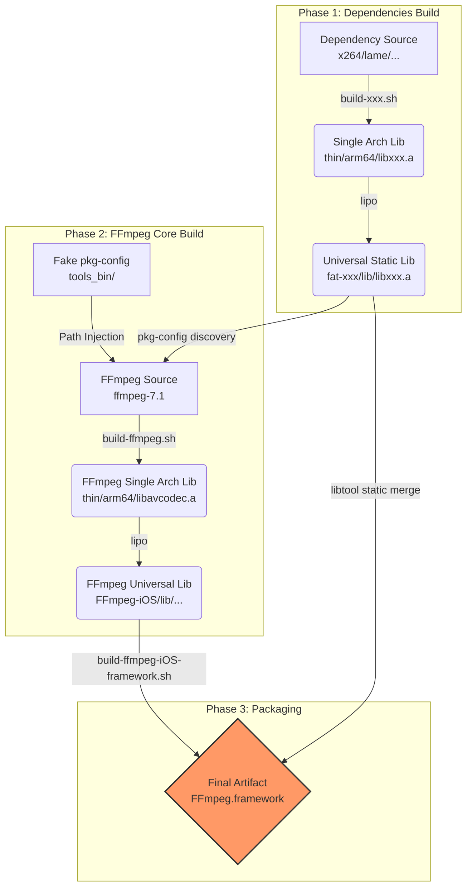

# FFmpeg Cross-Platform Build System (iOS, macOS, tvOS, Android) - FFmpeg 7.1 Technical Manual

[中文版](README_CN.md)

> **Acknowledgement**: This project is based on and improved from [kewlbear/FFmpeg-iOS-build-script](https://github.com/kewlbear/FFmpeg-iOS-build-script), deeply adapted and refactored for modern Xcode, Apple Silicon, and FFmpeg 7.0+.

This is an enterprise-level collection of shell scripts designed to solve the complexity of cross-compiling FFmpeg for iOS, tvOS, macOS, and Android on macOS. It is not just a compilation script, but a complete solution for **dependency management** and **artifact packaging**.

Based on the **FFmpeg 7.1** core, this project integrates mainstream codec libraries such as x264, x265, fdk-aac, dav1d, lame, opus, vpx, vorbis, and theora, and provides the ability to generate a `Framework` with one click, perfectly supporting Swift and Objective-C projects.

---

## 📚 Table of Contents

1.  [System Architecture & Workflow](#-system-architecture--workflow)
2.  [Environment Setup](#-environment-setup)
3.  [Build Guide](#-build-guide)
    *   [iOS (iPhone/iPad)](#ios-iphoneipad)
    *   [macOS (Apple Silicon/Intel)](#macos-apple-siliconintel)
    *   [tvOS (Apple TV)](#tvos-apple-tv)
    *   [Android](#android)
4.  [Integration Guide](#-integration-guide)
    *   [Xcode Integration Steps](#xcode-integration-steps)
    *   [Fixing Common Linker Errors](#fixing-common-linker-errors)
5.  [Configuration & Customization](#-configuration--customization)
    *   [FFmpeg Version & Architecture](#ffmpeg-version--architecture)
    *   [Slimming Down (Size Reduction)](#slimming-down-size-reduction)
    *   [Key Configure Flags](#key-configure-flags)
6.  [Script Reference](#-script-reference)
7.  [Licensing & Compliance](#-licensing--compliance)

---

## 🏗 System Architecture & Workflow

This build system adopts a **modular design**, following the workflow of "Compile dependencies first, then compile the core, and finally package".



---

## 🛠 Environment Setup

Before starting, ensure your macOS development environment is complete.

### 1. Xcode & Command Line Tools
Ensure you have the latest version of Xcode installed, and execute the following command to install the command line tools:
```bash
xcode-select --install
```

### 2. Build Tools (Homebrew)
FFmpeg and its dependency libraries require a series of build tools. Please use Homebrew to install them:

```bash
# Basic compilation tools
brew install yasm nasm cmake pkg-config

# Build systems for specific third-party libraries
brew install meson ninja      # For dav1d
brew install autoconf automake libtool # For fdk-aac, lame, etc.
```

*   **yasm/nasm**: Assembly compilers, crucial for x264/x265 performance.
*   **cmake/meson**: Build systems commonly used in modern C++ projects.
*   **pkg-config**: Dependency management tool, core to this script for discovering compiled libraries.
*   **gas-preprocessor.pl**: (The script downloads this automatically) Used to convert GNU assembly syntax to Apple Clang compatible syntax.

---

## 🚀 Build Guide

### iOS (iPhone/iPad)

The iOS build is the most complex as it usually involves the most third-party libraries.

#### Step 1: Compile Dependency Libraries (Optional)
The scripts are designed to be **loosely coupled**. If you don't need a library (e.g., you don't need x265), simply skip the corresponding script. `build-ffmpeg.sh` automatically detects which libraries have been compiled.

Recommended build order:
```bash
# 1. Basic Codecs
./build-x264.sh        # H.264 (GPL)
./build-fdk-aac.sh     # AAC (Non-Free)
./build-lame.sh        # MP3

# 2. Advanced Codecs (On demand)
./build-x265.sh        # H.265 (GPL, takes longer to compile)
./build-dav1d.sh       # AV1 Decoding
./build-opus.sh        # Opus Audio
./build-vpx.sh         # VP8/VP9

# 3. Ogg Ecosystem (Must follow order)
./build-ogg.sh         # Base layer
./build-vorbis.sh      # Depends on Ogg
./build-theora.sh      # Depends on Ogg
```

#### Step 2: Compile FFmpeg Core
```bash
./build-ffmpeg.sh
```
This step performs the following:
1.  Downloads FFmpeg 7.1 source code.
2.  Scans for `fat-*` folders in the current directory.
3.  Configures `pkg-config` paths to inject third-party libraries into the FFmpeg build configuration.
4.  Compiles for `arm64` (Device) and `x86_64` (Simulator) separately.
5.  Uses `lipo` to merge and generate the `FFmpeg-iOS` directory.

#### Step 3: Package Framework
```bash
./build-ffmpeg-iOS-framework.sh
```
This script is extremely important. It merges **all** compiled static libraries (including libx264.a, libmp3lame.a, etc.) into a single binary file within `FFmpeg.framework`. This means you **do not need** to manually add dozens of `.a` files to Xcode.

### macOS (Apple Silicon/Intel)
```bash
./build-ffmpeg-macos.sh
```
*   **Features**: Enables `VideoToolbox` (hardware acceleration) and `AudioToolbox`.
*   **Architecture**: Includes `arm64` and `x86_64`. The generated Framework can be used directly for macOS App development.

### tvOS (Apple TV)
```bash
./build-ffmpeg-tvos.sh
```
*   **Strategy**: tvOS App Store reviews are strict, and device performance is uniform. The script **does not integrate** third-party libraries by default to ensure maximum stability and pass review. It relies solely on FFmpeg's built-in software decoding and VideoToolbox hardware decoding.

### Android
```bash
# Set NDK path first
export ANDROID_NDK_HOME=/path/to/ndk
./build-ffmpeg-android.sh
```
*   **Artifacts**: `.so` dynamic libraries under `FFmpeg-Android/jniLibs/`.
*   **Architectures**: `arm64-v8a`, `armeabi-v7a`, `x86`, `x86_64`.

---

## 🔌 Integration Guide

### Xcode Integration Steps

1.  **Import Framework**: Drag `FFmpeg.framework` into your project.
2.  **Set Embed**: In **General** -> **Frameworks, Libraries, and Embedded Content**, set it to **Do Not Embed** (since it is a static library framework).
3.  **Add System Libraries**: Add the following system libraries in **Build Phases** -> **Link Binary With Libraries**, otherwise you will get `Undefined symbol` errors:
    *   `libz.tbd` (Compression)
    *   `libbz2.tbd` (Compression)
    *   `libiconv.tbd` (Character encoding)
    *   `AudioToolbox.framework` (Audio processing)
    *   `VideoToolbox.framework` (Hardware decoding)
    *   `CoreMedia.framework`
    *   `AVFoundation.framework`
    *   `libc++.tbd` (If you integrated C++ libraries like x265/dav1d)

4.  **Header Search Paths**:
    In **Build Settings**, find **Header Search Paths** and add:
    ```text
    $(PROJECT_DIR)/FFmpeg.framework/Headers
    ```
    Now you can use `#include "libavcodec/avcodec.h"`.

### Fixing Common Linker Errors

*   **Error**: `Undefined symbol: _VTDecompressionSessionCreate`
    *   **Fix**: Missing `VideoToolbox.framework`.
*   **Error**: `Undefined symbol: _inflate`
    *   **Fix**: Missing `libz.tbd`.
*   **Error**: `Undefined symbol: operator new(unsigned long)`
    *   **Fix**: Missing `libc++.tbd` (Usually because x265 or dav1d is written in C++).

---

## ⚙️ Configuration & Customization

All customizations are done by modifying variables at the top of the scripts.

### FFmpeg Version & Architecture
In `build-ffmpeg.sh`:
```bash
FF_VERSION="7.1"       # Change version
ARCHS="arm64 x86_64"   # Change architectures (e.g., remove x86_64 for device-only build)
```

### Slimming Down (Size Reduction)
FFmpeg includes a lot of redundant features by default. Modifying `CONFIGURE_FLAGS` can significantly reduce the size.

**Strategy A: Standard Player (Recommended)**
Disable encoders (playback only), disable muxers (demuxing only).
```bash
CONFIGURE_FLAGS="... --disable-encoders --disable-muxers"
```

**Strategy B: Extreme Slimming (Monitoring/Live Stream)**
Disable everything, enable only H.264/HEVC and AAC.
```bash
CONFIGURE_FLAGS="--disable-everything \
                 --enable-decoder=h264,hevc,aac \
                 --enable-demuxer=mov,flv,hls \
                 --enable-protocol=file,http,https,tcp,rtmp"
```

### Key Configure Flags

| Flag | Function | Recommendation | 
| :--- | :--- | :--- |
| `--enable-cross-compile` | Enables cross-compilation mode | **Must** |
| `--enable-pic` | Generates Position Independent Code | **Must** (Otherwise cannot link to dynamic libs or Apps) |
| `--disable-debug` | Disables debug symbols | Recommended to reduce size |
| `--disable-programs` | Do not compile ffmpeg/ffprobe CLI tools | **Must** (CLI tools cannot run on iOS) |
| `--enable-videotoolbox` | Enables iOS/macOS hardware acceleration | **Highly Recommended** |
| `--disable-vvc` | Disables H.266 (VVC) | **Recommended** (VVC assembly in 7.1 currently has compatibility issues on iOS) |
| `--enable-lto` | Enables Link Time Optimization | Optional (Slower compile, smaller binary) |

---

## 📜 Script Reference

| Script | Core Function & Tech Points | 
| :--- | :--- |
| **build-ffmpeg.sh** | **[Core]** Dynamically generates pkg-config env vars; calls configure with iOS SDK path; handles gas-preprocessor. |
| **build-x264.sh** | Automatically disables assembly optimization for simulator architectures to avoid relocation errors. |
| **build-x265.sh** | **[Hard]** Automatically patches `CMakeLists.txt` to fix policy errors; uses `-DENABLE_ASSEMBLY=OFF` to solve missing symbols. |
| **build-dav1d.sh** | **[Hard]** Dynamically generates Meson `cross-file` to precisely inject iOS SDK path and deployment target. |
| **build-theora.sh** | Automatically downloads latest `config.guess` to recognize arm64 architecture. |
| **build-ffmpeg-iOS-framework.sh** | Uses `libtool -static` for **full merge**; generates Swift-friendly `module.modulemap`. |

---

## ⚖️ Licensing & Compliance

**Extremely Important**: The license of FFmpeg depends on the modules you enable. Please consult legal counsel before commercial use.

| Enabled Lib | Modules Included | Final License | Commercial Restrictions | 
| :--- | :--- | :--- | :--- |
| **Default** | FFmpeg Core Only | **LGPL v2.1+** | Allowed to link and use, must declare use of FFmpeg in About page. |
| **+ x264/x265** | GPL Modules | **GPL v2+** | **Viral**: Your App must be open source, otherwise it cannot be listed on App Store (violates GPL). |
| **+ fdk-aac** | Non-Free | **Non-Free** | **Incompatible with GPL**. Not distributable unless you have a commercial license from Fraunhofer. |

**App Store Compliance Advice**:
*   Most commercial Apps **cannot** enable `--enable-gpl` (i.e., cannot integrate x264/x265).
*   It is recommended to use the iOS system built-in `VideoToolbox` (hardware acceleration) to handle H.264/H.265, which saves power and avoids GPL issues.
*   It is recommended to use the system `AudioToolbox` to handle AAC to avoid fdk-aac licensing issues.

This script enables GPL library support by default for learning and research purposes. **If releasing a commercial App, be sure to remove the detection or integration code for `x264` and `x265` in `build-ffmpeg.sh`.**
