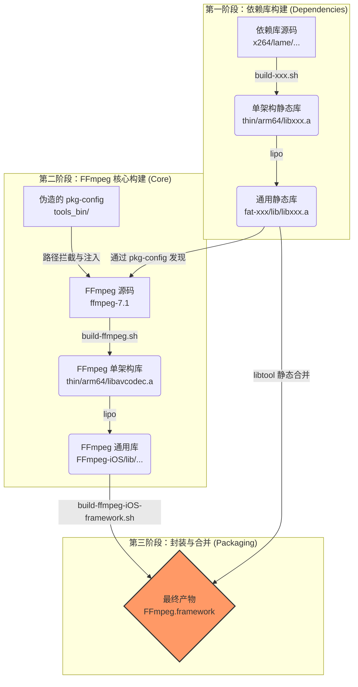

# FFmpeg 跨平台构建系统 (iOS, macOS, tvOS, Android) - FFmpeg 7.1 技术手册

[English Version](README.md)

> **致谢**: 本项目基于并改进自 [kewlbear/FFmpeg-iOS-build-script](https://github.com/kewlbear/FFmpeg-iOS-build-script)，针对现代 Xcode、Apple Silicon 及 FFmpeg 7.0+ 进行了深度适配与重构。

这是一个企业级的 Shell 脚本集合，旨在解决在 macOS 环境下为 iOS、tvOS、macOS 和 Android 交叉编译 FFmpeg 时面临的复杂性。它不仅仅是一个编译脚本，更是一套完整的**依赖管理**与**产物封装**解决方案。

本项目基于 **FFmpeg 7.1** 核心，集成了 x264, x265, fdk-aac, dav1d, lame, opus, vpx, vorbis, theora 等主流编解码库，并提供了一键生成 `Framework` 的能力，完美支持 Swift 和 Objective-C 项目。

---

## 📚 目录 (Table of Contents)

1.  [系统架构与工作流程](#-系统架构与工作流程)
2.  [环境准备与依赖安装](#-环境准备与依赖安装)
3.  [构建指南 (Build Guide)](#-构建指南-build-guide)
    *   [iOS (iPhone/iPad)](#ios-iphoneipad)
    *   [macOS (Apple Silicon/Intel)](#macos-apple-siliconintel)
    *   [tvOS (Apple TV)](#tvos-apple-tv)
    *   [Android](#android)
4.  [集成指南 (Integration Guide)](#-集成指南-integration-guide)
    *   [Xcode 集成步骤](#xcode-集成步骤)
    *   [常见链接错误修复](#常见链接错误修复)
5.  [核心技术实现原理 (Technical Deep Dive)](#-核心技术实现原理-technical-deep-dive)
    *   [1. 依赖库的智能注入 (pkg-config 劫持技术)](#1-依赖库的智能注入-pkg-config-劫持技术)
    *   [2. 汇编代码的兼容性处理 (Assembly & Bitcode)](#2-汇编代码的兼容性处理-assembly--bitcode)
    *   [3. 现代化的 Framework 封装](#3-现代化的-framework-封装)
    *   [4. tvOS 的特殊处理](#4-tvos-的特殊处理)
    *   [5. 老旧库的现代环境适配 (Theora/Vorbis/LAME)](#5-老旧库的现代环境适配-theoravorbislame)
    *   [6. libvpx 的特殊 Target 映射](#6-libvpx-的特殊-target-映射)
6.  [配置与深度定制 (Configuration)](#-配置与深度定制-configuration)
    *   [FFmpeg 版本与架构](#ffmpeg-版本与架构)
    *   [裁剪体积 (瘦身指南)](#裁剪体积-瘦身指南)
        *   [1. 基础瘦身 (Safe)](#1-基础瘦身-safe)
        *   [2. 进阶瘦身 (Recommended)](#2-进阶瘦身-recommended)
        *   [3. 极致瘦身 (Expert - 白名单模式)](#3-极致瘦身-expert---白名单模式)
        *   [4. 其他优化技巧](#4-其他优化技巧)
    *   [关键 Configure 参数详解](#关键-configure-参数详解)
    *   [体积参考表 (arm64 架构)](#-体积参考表-arm64-架构)
7.  [依赖库管理与构建细节 (Dependency Management & Build Internals)](#-依赖库管理与构建细节-dependency-management--build-internals)
    *   [1. 依赖库自动检测机制 (build-ffmpeg.sh)](#1-依赖库自动检测机制-build-ffmpegsh)
    *   [2. 各模块的特殊构建处理](#2-各模块的特殊构建处理)
8.  [目录结构说明](#-目录结构说明)
9.  [脚本功能详解 (Script Reference)](#-脚本功能详解-script-reference)
    *   [核心构建脚本](#核心构建脚本)
    *   [依赖库构建脚本 (按推荐顺序)](#依赖库构建脚本-按推荐顺序)
10. [许可证与合规性 (Licensing)](#-许可证与合规性-licensing)

---

## 🏗 系统架构与工作流程

本构建系统采用**模块化设计**，遵循“先编译依赖，再编译核心，最后打包封装”的流程。



---

## 🛠 环境准备与依赖安装

在开始之前，必须确保 macOS 开发环境完备。

### 1. Xcode & Command Line Tools
确保已安装最新版 Xcode，并执行以下命令安装命令行工具：
```bash
xcode-select --install
```

### 2. 构建工具 (Homebrew)
FFmpeg 及其依赖库需要一系列构建工具。请使用 Homebrew 安装：

```bash
# 基础编译工具
brew install yasm nasm cmake pkg-config

# 第三方库特定的构建系统
brew install meson ninja      # 用于 dav1d
brew install autoconf automake libtool # 用于 fdk-aac, lame 等
```

*   **yasm/nasm**: 汇编编译器，对 x264/x265 性能至关重要。
*   **cmake/meson**: 现代 C++ 项目常用的构建系统。
*   **pkg-config**: 依赖管理工具，本脚本核心依赖它来发现已编译的库。
*   **gas-preprocessor.pl**: (脚本会自动下载) 用于将 GNU 汇编语法转换为 Apple Clang 兼容的语法。

---

## 🚀 构建指南 (Build Guide)

### iOS (iPhone/iPad)

iOS 构建是最复杂的，因为通常涉及最多的第三方库。

#### 第一步：编译依赖库 (可选)
脚本设计为**松耦合**。如果你不需要某个库（例如不需要 x265），直接跳过对应的脚本即可。`build-ffmpeg.sh` 会自动检测哪些库已编译存在。

推荐的构建顺序：
```bash
# 1. 基础编解码器
./build-x264.sh        # H.264 (GPL)
./build-fdk-aac.sh     # AAC (Non-Free)
./build-lame.sh        # MP3

# 2. 进阶编解码器 (按需)
./build-x265.sh        # H.265 (GPL, 编译耗时较长)
./build-dav1d.sh       # AV1 解码
./build-opus.sh        # Opus 音频
./build-vpx.sh         # VP8/VP9

# 3. Ogg 生态 (必须按顺序)
./build-ogg.sh         # 基础层
./build-vorbis.sh      # 依赖 Ogg
./build-theora.sh      # 依赖 Ogg
```

#### 第二步：编译 FFmpeg 核心
```bash
./build-ffmpeg.sh
```
此步骤会完成以下工作：
1.  下载 FFmpeg 7.1 源码。
2.  扫描当前目录下的 `fat-*` 文件夹。
3.  配置 `pkg-config` 路径，将第三方库注入 FFmpeg 构建配置。
4.  分别为 `arm64` (真机) 和 `x86_64` (模拟器) 编译。
5.  使用 `lipo` 合并生成 `FFmpeg-iOS` 目录。

#### 第三步：打包 Framework
```bash
./build-ffmpeg-iOS-framework.sh
```
此脚本极其重要，它会将**所有**已编译的静态库（包括 libx264.a, libmp3lame.a 等）全部合并到 `FFmpeg.framework` 的单一二进制文件中。这意味着你**不需要**在 Xcode 中手动添加几十个 `.a` 文件。

### macOS (Apple Silicon/Intel)
```bash
./build-ffmpeg-macos.sh
```
*   **特性**: 启用 `VideoToolbox` (硬件加速) 和 `AudioToolbox`。
*   **架构**: 包含 `arm64` 和 `x86_64`，生成的 Framework 可直接用于 macOS App 开发。

### tvOS (Apple TV)
```bash
./build-ffmpeg-tvos.sh
```
*   **策略**: tvOS App Store 审核严格，且设备性能统一。脚本默认**不集成**第三方库，以确保最大稳定性及通过审核。仅依赖 FFmpeg 内置软解及 VideoToolbox 硬解。

### Android
```bash
# 需先设置 NDK 路径
export ANDROID_NDK_HOME=/path/to/ndk
./build-ffmpeg-android.sh
```
*   **产物**: `FFmpeg-Android/jniLibs/` 下的 `.so` 动态库。
*   **架构**: `arm64-v8a`, `armeabi-v7a`, `x86`, `x86_64`。

---

## 🔌 集成指南 (Integration Guide)

### Xcode 集成步骤

1.  **导入 Framework**: 将 `FFmpeg.framework` 拖入工程。
2.  **设置 Embed**: 在 **General** -> **Frameworks, Libraries, and Embedded Content** 中，设置为 **Do Not Embed** (因为是静态库封装的 Framework)。
3.  **添加系统库**: 在 **Build Phases** -> **Link Binary With Libraries** 中添加以下系统库，否则会报 `Undefined symbol` 错误：
    *   `libz.tbd` (压缩)
    *   `libbz2.tbd` (压缩)
    *   `libiconv.tbd` (字符编码)
    *   `AudioToolbox.framework` (音频处理)
    *   `VideoToolbox.framework` (硬件解码)
    *   `CoreMedia.framework`
    *   `AVFoundation.framework`
    *   `libc++.tbd` (如果集成了 x265/dav1d 等 C++ 库)

4.  **头文件路径 (Header Search Paths)**:
    在 **Build Settings** 中找到 **Header Search Paths**，添加：
    ```text
    $(PROJECT_DIR)/FFmpeg.framework/Headers
    ```
    这样你就可以使用 `#include "libavcodec/avcodec.h"`。

### 常见链接错误修复

*   **Error**: `Undefined symbol: _VTDecompressionSessionCreate`
    *   **Fix**: 缺少 `VideoToolbox.framework`。
*   **Error**: `Undefined symbol: _inflate`
    *   **Fix**: 缺少 `libz.tbd`。
*   **Error**: `Undefined symbol: operator new(unsigned long)`
    *   **Fix**: 缺少 `libc++.tbd` (通常是因为 x265 或 dav1d 是 C++ 编写的)。

---

## 🔬 核心技术实现原理 (Technical Deep Dive)

本套脚本不仅仅是简单的 `configure` 和 `make` 调用，它包含了一系列针对 iOS/tvOS 编译环境的“黑科技”修复与优化。

### 1. 依赖库的智能注入 (`pkg-config` 劫持技术)

FFmpeg 的构建系统极其依赖 `pkg-config` 来查找第三方库（如 x264, x265）。在交叉编译环境中，让 FFmpeg 正确找到我们刚刚编译好的 iOS 静态库（而不是系统安装的 macOS 库）是一个巨大的痛点。

**脚本解决方案 (`build-ffmpeg.sh`):**

*   **虚拟环境**: 脚本会在 `tools_bin/` 目录下动态创建一个伪造的 `pkg-config` 脚本。
*   **路径重定向**: 当 FFmpeg 请求 `x264` 的路径时，这个伪造脚本会拦截请求，并强制返回我们本地 `fat-x264/` 目录下的头文件和库路径。
*   **优势**: 彻底解决了 `Package xxxxx was not found` 的问题，且无需污染系统的环境变量。

### 2. 汇编代码的兼容性处理 (Assembly & Bitcode)

FFmpeg 包含了大量针对特定 CPU 优化的汇编代码，但这在 iOS Clang 编译器上经常报错。

*   **Gas-Preprocessor**: 脚本会自动检测并下载 `gas-preprocessor.pl`，这是一个 Perl 脚本，用于将 GNU 汇编器 (GAS) 语法转换为 Apple Clang 兼容的语法。
*   **VVC 模块屏蔽**: FFmpeg 7.1 引入的 VVC (H.266) 解码器包含大量新的 AArch64 汇编，目前与 iOS 交叉编译工具链存在兼容性问题。脚本通过 `--disable-vvc` 自动规避了此编译错误，确保整体构建成功。
*   **Bitcode 支持**: 默认开启 `-fembed-bitcode` 标志，确保编译出的静态库包含 Bitcode 段（尽管 Xcode 14 已弃用，但为了兼容旧项目仍保留）。

### 3. 现代化的 Framework 封装

传统的脚本通常只生成 `.a` 文件。本项目的 `build-ffmpeg-iOS-framework.sh` 脚本做了更多工作：

*   **一体化二进制文件**: 使用 `libtool -static` 将**所有**编译好的静态库（包括 FFmpeg 核心和已启用的第三方库，如 x264、LAME 等）合并为 Framework 内的一个单一可执行文件。这意味着您无需在项目中链接多个 `.a` 文件。
*   **Module Map**: 自动生成 `module.modulemap` 文件，允许在 Swift 项目中直接使用 `import FFmpeg`。
*   **伞头文件 (Umbrella Header)**: 自动生成 `FFmpeg.h` 伞头文件。

### 4. tvOS 的特殊处理

tvOS 版本旨在实现最大的稳定性，并遵循**极简原则**：

*   **不集成第三方库**: 为了避免复杂的链接错误以及由于受限 API 可能导致的 App Store 被拒，`build-ffmpeg-tvos.sh` 不集成任何第三方编解码器（如 x264/x265）。它完全依赖 FFmpeg 的内置解码器和系统级硬件加速。
*   **有针对性的裁剪**: 显式禁用 `--disable-swscale-alpha` 和其他模块，以确保在 Apple TV 平台上的最佳性能。

### 5. 老旧库的现代环境适配 (Theora/Vorbis/LAME)

许多经典的开源库（如 libtheora, libvorbis）其构建系统较为陈旧，无法直接识别 `arm64-apple-ios` 架构。

*   **自动补丁**: `build-theora.sh` 和 `build-vorbis.sh` 会自动检测并从 GNU 官方下载最新的 `config.guess` 和 `config.sub`，并使用 `sed` 移除过时的 `-force_cpusubtype_ALL` 链接标志，解决了现代 Xcode 链接器报错的问题。
*   **依赖链管理**: 针对 Ogg 家族，脚本严格遵循 `libogg -> libvorbis/libtheora` 的顺序，并自动在 `configure` 阶段注入正确的头文件搜索路径。

### 6. libvpx 的特殊 Target 映射

libvpx (VP8/VP9) 拥有自己独立的配置系统。

*   **Target 转换**: 脚本自动将 iOS 的 `arm64` 和 `x86_64` 架构映射为 libvpx 特有的 `arm64-darwin20-gcc` 和 `x86_64-darwin20-gcc` 目标。
*   **高位深支持**: 默认开启 `--enable-vp9-highbitdepth`，以支持更专业的视频回放需求。

---

## ⚙️ 配置与深度定制 (Configuration)

所有的自定义均通过修改脚本头部的变量实现。

### FFmpeg 版本与架构
在 `build-ffmpeg.sh` 中：
```bash
FF_VERSION="7.1"       # 更改版本
ARCHS="arm64 x86_64"   # 更改架构 (如仅需真机，去掉 x86_64)
```

### 裁剪体积 (瘦身指南)

FFmpeg 默认开启了大量罕见的编解码器和协议，这会导致生成的 Framework 体积非常大（通常在 50MB-100MB 之间）。对于移动应用来说，体积控制至关重要。

通过修改 `build-ffmpeg.sh` 中的 `CONFIGURE_FLAGS` 变量，您可以实现不同程度的瘦身。

#### 1. 基础瘦身 (Safe)
这些选项风险极低，不会影响任何核心功能，但能减小一部分体积。脚本默认已经开启了这些选项。
```bash
CONFIGURE_FLAGS="--disable-debug \           # 移除调试符号 (必须)
                 --disable-programs \        # 不编译 ffmpeg/ffprobe 命令行工具 (iOS 不需要)
                 --disable-doc \             # 不生成文档
                 --disable-avdevice \        # 禁用音视频捕获设备 (通常使用 AVFoundation)
                 --disable-postproc"         # 禁用后期处理模块 (通常用不到)
```

#### 2. 进阶瘦身 (Recommended)
适用于大多数播放器应用。
*   **禁用编码器 (Encoders)**: 如果你的 App 只是播放视频，不需要录制或转码，可以禁用所有编码器。
*   **禁用复用器 (Muxers)**: 播放只需要解复用 (Demux)，不需要封装 (Mux)。
*   **禁用非必要滤镜**: FFmpeg 内置了数百个滤镜，保留 `scale` (缩放) 和 `format` (像素格式转换) 通常就足够了。

```bash
CONFIGURE_FLAGS="... \
                 --disable-encoders \        # 禁用所有编码器
                 --disable-muxers \          # 禁用所有复用器
                 --disable-filters \         # 禁用所有滤镜
                 --enable-filter=scale,format,null" # 仅按需开启 scale 等
```
*预计收益: 减小约 40% 体积*

#### 3. 极致瘦身 (Expert - 白名单模式)
这是最激进但也最有效的方案。采用“先禁用所有，再按需开启”的策略。适用于对包体积极其敏感（如 App Clip）的场景。

**场景示例：仅支持 H.264/H.265/AAC 的在线点播播放器**

```bash
CONFIGURE_FLAGS="--disable-everything \                 # 1. 禁用所有组件
                 --enable-pic --enable-cross-compile \  # 2. 恢复基础编译选项
                 --enable-decoder=h264,hevc,aac \       # 3. 仅开启需要的解码器
                 --enable-demuxer=mov,m4v,mp4,flv \     # 4. 仅开启需要的容器 (MP4/MOV)
                 --enable-parser=h264,hevc,aac \        # 5. 开启对应解析器
                 --enable-protocol=file,http,https,tcp \ # 6. 开启网络协议
                 --enable-videotoolbox \                # 7. 开启硬解
                 --enable-filter=scale,format"          # 8. 基础滤镜
```
*预计收益: Framework 体积可压缩至 10MB - 15MB 左右*

#### 4. 其他优化技巧

*   **Strip (去除符号表)**:
    脚本生成的静态库 (`.a`) 保留了符号表以便于链接。在 Xcode 构建最终 App 时，Release 模式默认会自动执行 `Strip Linked Product`，移除无用符号。因此，你通常不需要手动 strip 静态库，除非你分发的是 SDK。
    *如果要手动 strip*: `xcrun strip -S libavcodec.a`

*   **LTO (链接时优化)**:
    在 `CONFIGURE_FLAGS` 中添加 `--enable-lto`。
    这会让编译器在链接阶段进行全局死代码消除 (Dead Code Elimination)。虽然会显著增加编译时间，但通常能进一步减小 5%-10% 的体积。

*   **Bitcode**:
    脚本默认开启 `-fembed-bitcode`。虽然 Xcode 14+ 已弃用 Bitcode，但为了兼容旧项目，保留此选项是安全的。Bitcode 会增加 `.a` 文件的大小，但**不会**增加最终 App Store 分发包的大小（Apple 会在服务器端处理）。

#### 关键 Configure 参数详解

| 参数                     | 作用                                         | 建议                                                 |
| :----------------------- | :------------------------------------------- | :--------------------------------------------------- |
| `--enable-cross-compile` | 开启交叉编译模式                             | **必须**                                             |
| `--enable-pic`           | 生成位置无关代码 (Position Independent Code) | **必须** (否则无法链接到动态库或 App)                |
| `--disable-debug`        | 禁用调试符号                                 | 推荐开启以减小体积                                   |
| `--disable-programs`     | 不编译 ffmpeg/ffprobe 命令行工具             | **必须** (iOS 无法运行命令行工具)                    |
| `--enable-videotoolbox`  | 开启 iOS/macOS 硬件加速支持                  | **强烈推荐**                                         |
| `--disable-vvc`          | 禁用 H.266 (VVC)                             | **推荐** (目前 7.1 中 VVC 汇编在 iOS 编译有兼容问题) |
| `--enable-lto`           | 开启链接时优化                               | 可选 (编译变慢，体积减小)                            |

#### 体积参考表 (arm64 架构)

| 配置方案                                      | 预计 Framework 体积 | 适用场景                       |
| :-------------------------------------------- | :------------------ | :----------------------------- |
| **全功能版** (含 x264/x265/VP9/AV1/Opus/LAME) | 100MB+              | 专业视频剪辑、全格式全能播放器 |
| **通用音视频版** (含 x264/AAC/MP3/Opus)       | 60MB - 80MB         | 主流社交、短视频 App           |
| **仅播放版** (禁用编码/滤镜)                  | 40MB - 50MB         | 通用短视频、直播 App           |
| **硬解白名单版**                              | 12MB - 18MB         | 极简播放器、H.264 监控         |
| **单架构 (无 x86_64)**                        | 减小约 45%          | 最终 App Store 发布版本        |

---

## 🔧 依赖库管理与构建细节 (Dependency Management & Build Internals)

为了实现“开箱即用”并规避常见的交叉编译坑，脚本内置了一套智能的依赖查找和构建修复机制。了解这些细节有助于您进行更深度的定制。

### 1. 依赖库自动检测机制 (`build-ffmpeg.sh`)

脚本不强制要求依赖库必须在特定路径，而是采用动态扫描机制。在运行 `build-ffmpeg.sh` 时：

1. **环境变量优先**: 如果您希望使用自己编译的库，可以通过设置环境变量来覆盖。

   ```bash
   # 示例：强制使用指定路径的 x264
   export X264="/Users/dev/my-custom-x264"
   ./build-ffmpeg.sh
   ```

2. **自动目录扫描**: 如果未设置环境变量，脚本会自动在**当前目录** (`.`) 和**上级目录** (`..`) 搜寻标准命名文件夹：

   *   **x264**: 查找 `fat-x264`, `x264-ios`, `x264`
   *   **x265**: 查找 `fat-x265`, `x265-ios`, `x265`
   *   **fdk-aac**: 查找 `fdk-aac-ios`, `fdk-aac`, `fat-fdk-aac`
   *   **dav1d**: 查找 `fat-dav1d`, `dav1d-ios`, `dav1d`
   *   **lame**: 查找 `fat-lame`, `lame-ios`
   *   **vpx**: 查找 `fat-vpx`, `libvpx-ios`
   *   **ogg/vorbis/theora**: 自动查找对应的 `fat-*` 目录

### 2. 各模块的特殊构建处理

*   **x265 (CMake)**:
    *   **自动 Patch**: `build-x265.sh` 会自动修改源码中的 `CMakeLists.txt`，移除过时的策略设置 (CMP0025, CMP0054) 并升级最低版本要求，以修复在现代 CMake 环境下的配置报错。
    *   **禁用汇编**: 针对 iOS 平台强制设置 `-DENABLE_ASSEMBLY=OFF`，解决了部分链接符号缺失的问题。
*   **dav1d (Meson/Ninja)**:
    *   **动态交叉文件**: `build-dav1d.sh` 会根据当前的 Xcode SDK 路径，实时生成 Meson 所需的 `cross-file` (例如 `dav1d-cross-arm64.txt`)，确保编译器和链接器标志完全匹配。
*   **x264**:
    *   **模拟器兼容性**: 在编译 `x86_64` (模拟器) 版本时，脚本自动添加了 `--disable-asm`。这是为了规避旧版 x264 汇编代码在 macOS 新版链接器下可能产生的重定位错误，而真机 (`arm64`) 版本依然保留汇编优化。
*   **FFmpeg VVC (H.266)**:
    *   **暂时屏蔽**: 鉴于 FFmpeg 7.1 新引入的 VVC 解码器中包含大量尚未完全适配 iOS 工具链的 AArch64 汇编代码，`build-ffmpeg.sh` 默认通过 `--disable-decoder=vvc` 将其禁用，以确保整体构建的成功率。

---

## 📂 目录结构说明

本构建系统生成的目录结构逻辑清晰，分为源码、中间产物、通用库和最终封装四个层次：

```text
├── build-*.sh                 # 构建脚本群
├── tools_bin/                 # [自动生成] 编译辅助工具 (pkg-config, gas-preprocessor.pl)
├── pkgconfig_temp/            # [自动生成] 临时生成的 .pc 文件 (供 FFmpeg configure 使用)
├── scratch/                   # [临时] FFmpeg 编译中间文件 (.o)
├── scratch-*/                 # [临时] 第三方库编译中间文件
├── thin/                      # [中间产物] FFmpeg 单架构静态库 (arm64, x86_64)
├── thin-*/                    # [中间产物] 第三方库单架构静态库
├── FFmpeg-iOS/                # [通用库] FFmpeg 合并后的 Fat 静态库 (lib/, include/)
├── FFmpeg-Android/            # [通用库] Android .so 动态库 (jniLibs/结构)
├── fat-*/                     # [通用库] 第三方库合并后的 Fat 静态库 (如 fat-x264/)
├── FFmpeg.framework/          # [最终产物] iOS 动态 Framework (包含所有链接库)
├── FFmpeg-macOS.framework/    # [最终产物] macOS Framework
├── FFmpeg-tvOS.framework/     # [最终产物] tvOS Framework
└── LICENSE                    # 许可证文件
```

---

## 📜 脚本功能详解 (Script Reference)

### 核心构建脚本

| 脚本文件名 | 功能描述 | 关键产物 |
| :--- | :--- | :--- |
| **`build-ffmpeg.sh`** | **核心脚本**。下载 FFmpeg 7.1，自动识别 `fat-*` 目录下的第三方库，生成 `pkg-config` 映射，编译并合并出 `FFmpeg-iOS` 静态库。 | `FFmpeg-iOS/` |
| **`build-ffmpeg-iOS-framework.sh`** | **封装脚本**。将 `FFmpeg-iOS` 与所有检测到的第三方库 (`fat-x264` 等) 使用 `libtool` 合并为一个单一的二进制文件，并生成 `Headers`, `Info.plist` 和 `module.modulemap`，制作成标准的 Framework。 | `FFmpeg.framework` |
| **`build-ffmpeg-macos.sh`** | **macOS 构建**。构建适用于 macOS (Apple Silicon + Intel) 的 Framework。默认开启 `VideoToolbox` 和 `AudioToolbox`，支持硬解。 | `FFmpeg-macOS.framework` |
| **`build-ffmpeg-tvos.sh`** | **tvOS 构建**。构建适用于 Apple TV 的 Framework。采用极简配置，禁用 `vvc` 及部分滤镜以确保稳定性。 | `FFmpeg-tvOS.framework` |
| **`build-ffmpeg-android.sh`** | **Android 构建**。需要设置 `ANDROID_NDK_HOME`。构建 `arm64-v8a`, `armeabi-v7a`, `x86`, `x86_64` 四种架构的动态库 (`.so`)。 | `FFmpeg-Android/jniLibs/` |
| **`clean.sh`** | **清理脚本**。交互式清理所有编译产生的源码目录、中间文件 (`scratch`, `thin`) 和最终产物，将项目重置为初始状态。 | (删除文件) |

### 依赖库构建脚本 (按推荐顺序)

所有依赖脚本均会自动下载源码、配置交叉编译环境、修正兼容性问题，并生成 `fat-xxx` 通用库目录。

| 脚本文件名 | 库 (版本) | 特殊处理与优化 |
| :--- | :--- | :--- |
| **`build-x264.sh`** | x264 (master) | 模拟器架构禁用汇编 (`--disable-asm`) 以避免重定位错误；真机保留汇编优化。 |
| **`build-fdk-aac.sh`** | fdk-aac (master) | 使用 `autogen.sh` 生成配置；标准 Autotools 流程。 |
| **`build-lame.sh`** | LAME (3.100) | 禁用前端工具 (`--disable-frontend`)；修正并发编译问题。 |
| **`build-x265.sh`** | x265 (3.4) | **自动 Patch**: 修改 `CMakeLists.txt` 修复策略报错；强制禁用汇编 (`-DENABLE_ASSEMBLY=OFF`) 解决 iOS 链接符号缺失。 |
| **`build-dav1d.sh`** | dav1d (master) | **动态 Cross-file**: 根据 SDK 路径实时生成 Meson 交叉编译配置文件 (`.txt`)。 |
| **`build-opus.sh`** | Opus (1.4) | 标准构建流程。 |
| **`build-vpx.sh`** | libvpx (HEAD) | 启用高位深 (`--enable-vp9-highbitdepth`)；自动映射 Target (`arm64-darwin20-gcc`)。 |
| **`build-ogg.sh`** | libogg (1.3.5) | 基础容器库，后续 Vorbis/Theora 的依赖。 |
| **`build-vorbis.sh`** | libvorbis (1.3.7) | 自动移除过时的 `-force_cpusubtype_ALL` 链接标志；链接 `fat-ogg`。 |
| **`build-theora.sh`** | libtheora (1.1.1) | **自动更新**: 下载最新的 `config.guess` 和 `config.sub` 以支持 arm64；移除过时链接标志。 |

---

## ⚖️ 许可证与合规性 (Licensing)

**极其重要**：FFmpeg 的许可证取决于您启用的模块。请务必在商用前咨询法务。

| 启用库 | 包含模块 | 最终许可证 | 商业应用限制 | 
| :--- | :--- | :--- | :--- |
| **默认** | 仅 FFmpeg 核心 | **LGPL v2.1+** | 允许链接使用，需在关于页面声明使用了 FFmpeg。 |
| **+ x264/x265** | GPL 模块 | **GPL v2+** | **传染性**：您的 App 必须开源，否则不能上架 App Store (违反 GPL)。 |
| **+ fdk-aac** | Non-Free | **Non-Free** | **不兼容 GPL**。除非获得 Fraunhofer 的商业授权，否则通常不允许分发。 |

**App Store 合规建议**:
*   绝大多数商业 App **不能**开启 `--enable-gpl` (即不能集成 x264/x265)。
*   推荐使用 iOS 系统自带的 `VideoToolbox` (硬件加速) 来处理 H.264/H.265，既省电又规避了 GPL 版权问题。
*   推荐使用系统 `AudioToolbox` 处理 AAC，规避 fdk-aac 版权问题。

本脚本默认开启了 GPL 库的支持以便于学习研究。**若要发布商业 App，请务必在 `build-ffmpeg.sh` 中移除 `x264`, `x265` 的检测或集成代码。
