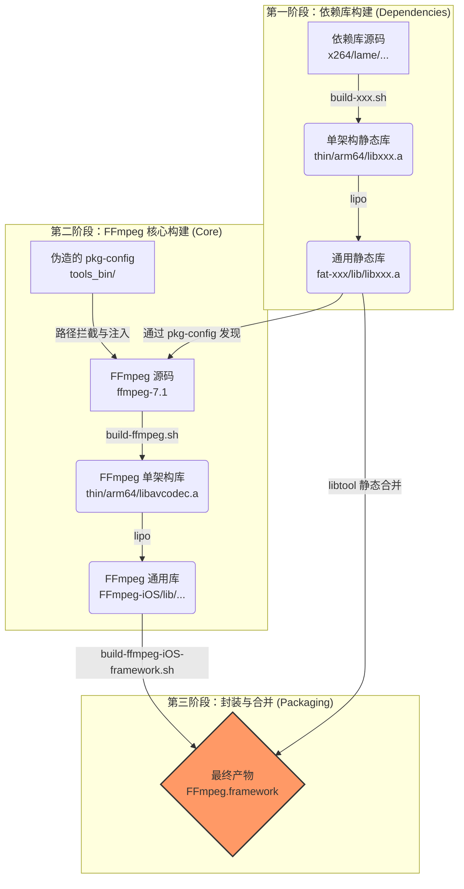

# FFmpeg 跨平台构建系统 (iOS, macOS, tvOS, Android) - FFmpeg 7.1 技术手册

[English Version](README.md)

> **致谢**: 本项目基于并改进自 [kewlbear/FFmpeg-iOS-build-script](https://github.com/kewlbear/FFmpeg-iOS-build-script)，针对现代 Xcode、Apple Silicon 及 FFmpeg 7.0+ 进行了深度适配与重构。

这是一个企业级的 Shell 脚本集合，旨在解决在 macOS 环境下为 iOS、tvOS、macOS 和 Android 交叉编译 FFmpeg 时面临的复杂性。它不仅仅是一个编译脚本，更是一套完整的**依赖管理**与**产物封装**解决方案。

本项目基于 **FFmpeg 7.1** 核心，集成了 x264, x265, fdk-aac, dav1d, lame, opus, vpx, vorbis, theora 等主流编解码库，并提供了一键生成 `Framework` 的能力，完美支持 Swift 和 Objective-C 项目。

---

## 📚 目录 (Table of Contents)

1.  [系统架构与工作流程](#-系统架构与工作流程)
2.  [环境准备与依赖安装](#-环境准备与依赖安装)
3.  [构建指南 (Build Guide)](#-构建指南-build-guide)
    *   [iOS (iPhone/iPad)](#ios-iphoneipad)
    *   [macOS (Apple Silicon/Intel)](#macos-apple-siliconintel)
    *   [tvOS (Apple TV)](#tvos-apple-tv)
    *   [Android](#android)
4.  [集成指南 (Integration Guide)](#-集成指南-integration-guide)
    *   [Xcode 集成步骤](#xcode-集成步骤)
    *   [常见链接错误修复](#常见链接错误修复)
5.  [配置与深度定制 (Configuration)](#-配置与深度定制-configuration)
    *   [FFmpeg 版本与架构](#ffmpeg-版本与架构)
    *   [裁剪体积 (瘦身指南)](#裁剪体积-瘦身指南)
    *   [关键 Configure 参数详解](#关键-configure-参数详解)
6.  [脚本功能详解 (Script Reference)](#-脚本功能详解-script-reference)
7.  [许可证与合规性 (Licensing)](#-许可证与合规性-licensing)

---

## 🏗 系统架构与工作流程

本构建系统采用**模块化设计**，遵循“先编译依赖，再编译核心，最后打包封装”的流程。



---

## 🛠 环境准备与依赖安装

在开始之前，必须确保 macOS 开发环境完备。

### 1. Xcode & Command Line Tools
确保已安装最新版 Xcode，并执行以下命令安装命令行工具：
```bash
xcode-select --install
```

### 2. 构建工具 (Homebrew)
FFmpeg 及其依赖库需要一系列构建工具。请使用 Homebrew 安装：

```bash
# 基础编译工具
brew install yasm nasm cmake pkg-config

# 第三方库特定的构建系统
brew install meson ninja      # 用于 dav1d
brew install autoconf automake libtool # 用于 fdk-aac, lame 等
```

*   **yasm/nasm**: 汇编编译器，对 x264/x265 性能至关重要。
*   **cmake/meson**: 现代 C++ 项目常用的构建系统。
*   **pkg-config**: 依赖管理工具，本脚本核心依赖它来发现已编译的库。
*   **gas-preprocessor.pl**: (脚本会自动下载) 用于将 GNU 汇编语法转换为 Apple Clang 兼容的语法。

---

## 🚀 构建指南 (Build Guide)

### iOS (iPhone/iPad)

iOS 构建是最复杂的，因为通常涉及最多的第三方库。

#### 第一步：编译依赖库 (可选)
脚本设计为**松耦合**。如果你不需要某个库（例如不需要 x265），直接跳过对应的脚本即可。`build-ffmpeg.sh` 会自动检测哪些库已编译存在。

推荐的构建顺序：
```bash
# 1. 基础编解码器
./build-x264.sh        # H.264 (GPL)
./build-fdk-aac.sh     # AAC (Non-Free)
./build-lame.sh        # MP3

# 2. 进阶编解码器 (按需)
./build-x265.sh        # H.265 (GPL, 编译耗时较长)
./build-dav1d.sh       # AV1 解码
./build-opus.sh        # Opus 音频
./build-vpx.sh         # VP8/VP9

# 3. Ogg 生态 (必须按顺序)
./build-ogg.sh         # 基础层
./build-vorbis.sh      # 依赖 Ogg
./build-theora.sh      # 依赖 Ogg
```

#### 第二步：编译 FFmpeg 核心
```bash
./build-ffmpeg.sh
```
此步骤会完成以下工作：
1.  下载 FFmpeg 7.1 源码。
2.  扫描当前目录下的 `fat-*` 文件夹。
3.  配置 `pkg-config` 路径，将第三方库注入 FFmpeg 构建配置。
4.  分别为 `arm64` (真机) 和 `x86_64` (模拟器) 编译。
5.  使用 `lipo` 合并生成 `FFmpeg-iOS` 目录。

#### 第三步：打包 Framework
```bash
./build-ffmpeg-iOS-framework.sh
```
此脚本极其重要，它会将**所有**已编译的静态库（包括 libx264.a, libmp3lame.a 等）全部合并到 `FFmpeg.framework` 的单一二进制文件中。这意味着你**不需要**在 Xcode 中手动添加几十个 `.a` 文件。

### macOS (Apple Silicon/Intel)
```bash
./build-ffmpeg-macos.sh
```
*   **特性**: 启用 `VideoToolbox` (硬件加速) 和 `AudioToolbox`。
*   **架构**: 包含 `arm64` 和 `x86_64`，生成的 Framework 可直接用于 macOS App 开发。

### tvOS (Apple TV)
```bash
./build-ffmpeg-tvos.sh
```
*   **策略**: tvOS App Store 审核严格，且设备性能统一。脚本默认**不集成**第三方库，以确保最大稳定性及通过审核。仅依赖 FFmpeg 内置软解及 VideoToolbox 硬解。

### Android
```bash
# 需先设置 NDK 路径
export ANDROID_NDK_HOME=/path/to/ndk
./build-ffmpeg-android.sh
```
*   **产物**: `FFmpeg-Android/jniLibs/` 下的 `.so` 动态库。
*   **架构**: `arm64-v8a`, `armeabi-v7a`, `x86`, `x86_64`。

---

## 🔌 集成指南 (Integration Guide)

### Xcode 集成步骤

1.  **导入 Framework**: 将 `FFmpeg.framework` 拖入工程。
2.  **设置 Embed**: 在 **General** -> **Frameworks, Libraries, and Embedded Content** 中，设置为 **Do Not Embed** (因为是静态库封装的 Framework)。
3.  **添加系统库**: 在 **Build Phases** -> **Link Binary With Libraries** 中添加以下系统库，否则会报 `Undefined symbol` 错误：
    *   `libz.tbd` (压缩)
    *   `libbz2.tbd` (压缩)
    *   `libiconv.tbd` (字符编码)
    *   `AudioToolbox.framework` (音频处理)
    *   `VideoToolbox.framework` (硬件解码)
    *   `CoreMedia.framework`
    *   `AVFoundation.framework`
    *   `libc++.tbd` (如果集成了 x265/dav1d 等 C++ 库)

4.  **头文件路径 (Header Search Paths)**:
在 **Build Settings** 中找到 **Header Search Paths**，添加：
    ```text
    $(PROJECT_DIR)/FFmpeg.framework/Headers
    ```
    这样你就可以使用 `#include "libavcodec/avcodec.h"`。

### 常见链接错误修复

*   **Error**: `Undefined symbol: _VTDecompressionSessionCreate`
    *   **Fix**: 缺少 `VideoToolbox.framework`。
*   **Error**: `Undefined symbol: _inflate`
    *   **Fix**: 缺少 `libz.tbd`。
*   **Error**: `Undefined symbol: operator new(unsigned long)`
    *   **Fix**: 缺少 `libc++.tbd` (通常是因为 x265 或 dav1d 是 C++ 编写的)。

---

## ⚙️ 配置与深度定制 (Configuration)

所有的自定义均通过修改脚本头部的变量实现。

### FFmpeg 版本与架构
在 `build-ffmpeg.sh` 中：
```bash
FF_VERSION="7.1"       # 更改版本
ARCHS="arm64 x86_64"   # 更改架构 (如仅需真机，去掉 x86_64)
```

### 裁剪体积 (瘦身指南)
FFmpeg 默认包含大量冗余功能。通过修改 `CONFIGURE_FLAGS` 可以显著减小体积。

**方案 A: 标准播放器 (推荐)**
禁用编码器（只播放），禁用混流器（只解包）。
```bash
CONFIGURE_FLAGS="... --disable-encoders --disable-muxers"
```

**方案 B: 极限瘦身 (监控/直播流)**
禁用所有，仅开启 H.264/HEVC 和 AAC。
```bash
CONFIGURE_FLAGS="--disable-everything \
                 --enable-decoder=h264,hevc,aac \
                 --enable-demuxer=mov,flv,hls \
                 --enable-protocol=file,http,https,tcp,rtmp"
```

### 关键 Configure 参数详解

| 参数 | 作用 | 建议 | 
| :--- | :--- | :--- |
| `--enable-cross-compile` | 开启交叉编译模式 | **必须** |
| `--enable-pic` | 生成位置无关代码 (Position Independent Code) | **必须** (否则无法链接到动态库或 App) |
| `--disable-debug` | 禁用调试符号 | 推荐开启以减小体积 |
| `--disable-programs` | 不编译 ffmpeg/ffprobe 命令行工具 | **必须** (iOS 无法运行命令行工具) |
| `--enable-videotoolbox` | 开启 iOS/macOS 硬件加速支持 | **强烈推荐** |
| `--disable-vvc` | 禁用 H.266 (VVC) | **推荐** (目前 7.1 中 VVC 汇编在 iOS 编译有兼容问题) |
| `--enable-lto` | 开启链接时优化 | 可选 (编译变慢，体积减小) |

---

## 📜 脚本功能详解 (Script Reference)

| 脚本 | 核心功能与技术点 | 
| :--- | :--- |
| **build-ffmpeg.sh** | **[核心]** 动态生成 pkg-config 环境变量；调用 configure 传入 iOS SDK 路径；处理 gas-preprocessor。 |
| **build-x264.sh** | 自动禁用模拟器架构的汇编优化以避免重定位错误。 |
| **build-x265.sh** | **[难点]** 自动 Patch `CMakeLists.txt` 修复策略错误；使用 `-DENABLE_ASSEMBLY=OFF` 解决符号丢失。 |
| **build-dav1d.sh** | **[难点]** 动态生成 Meson `cross-file`，精准注入 iOS SDK 路径和部署版本。 |
| **build-theora.sh** | 自动下载最新的 `config.guess` 以识别 arm64 架构。 |
| **build-ffmpeg-iOS-framework.sh** | 使用 `libtool -static` 进行**全量合并**；生成 Swift 友好的 `module.modulemap`。 |

---

## ⚖️ 许可证与合规性 (Licensing)

**极其重要**：FFmpeg 的许可证取决于您启用的模块。请务必在商用前咨询法务。

| 启用库 | 包含模块 | 最终许可证 | 商业应用限制 | 
| :--- | :--- | :--- | :--- |
| **默认** | 仅 FFmpeg 核心 | **LGPL v2.1+** | 允许链接使用，需在关于页面声明使用了 FFmpeg。 |
| **+ x264/x265** | GPL 模块 | **GPL v2+** | **传染性**：您的 App 必须开源，否则不能上架 App Store (违反 GPL)。 |
| **+ fdk-aac** | Non-Free | **Non-Free** | **不兼容 GPL**。除非获得 Fraunhofer 的商业授权，否则通常不允许分发。 |

**App Store 合规建议**:
*   绝大多数商业 App **不能**开启 `--enable-gpl` (即不能集成 x264/x265)。
*   推荐使用 iOS 系统自带的 `VideoToolbox` (硬件加速) 来处理 H.264/H.265，既省电又规避了 GPL 版权问题。
*   推荐使用系统 `AudioToolbox` 处理 AAC，规避 fdk-aac 版权问题。

本脚本默认开启了 GPL 库的支持以便于学习研究。**若要发布商业 App，请务必在 `build-ffmpeg.sh` 中移除 `x264`, `x265` 的检测或集成代码。
